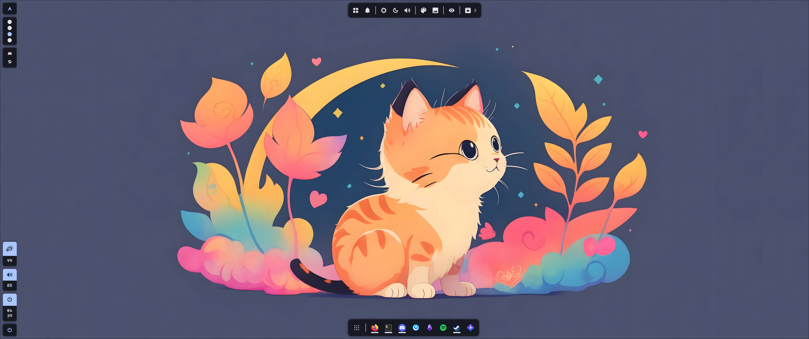

# My Dotfiles

This repository contains my personal dotfiles. They are highly personalized and
I do not recommend installing the whole thing outright (if you are not me 🙂).

## Widgets Screenshot

## Tooling

I use the following tools in my daily workflow:

- **Window Manager**: [Hyprland](https://github.com/hyprwm/Hyprland)
- **Desktop UI**: [Aylur's Gtk Shell](https://github.com/Aylur/ags)
- **Editor**: [Neovim](https://neovim.io/) / [LazyVim](https://www.lazyvim.org/)
- **Terminal**: [Foot](https://codeberg.org/dnkl/foot) /
  [Tmux](https://tmux.github.io/)
- **Prompt**: [Starship](https://starship.rs/)
- **Font**: [Geist Mono](https://vercel.com/font)

## Dotbot

Dotfiles are managed and installed using Dotbot and some additional Dotbot
plugins:

- [Dotbot](https://github.com/anishathalye/dotbot): Overall dotfile management
- [Dotbot-yay](https://github.com/sobolevn/dotbot-asdf): Auto-install pacman/yay
  dependencies
- [Dotbot-asdf](https://github.com/OxSon/dotbot-yay/): Automatic setup of
  various asdf plugins
